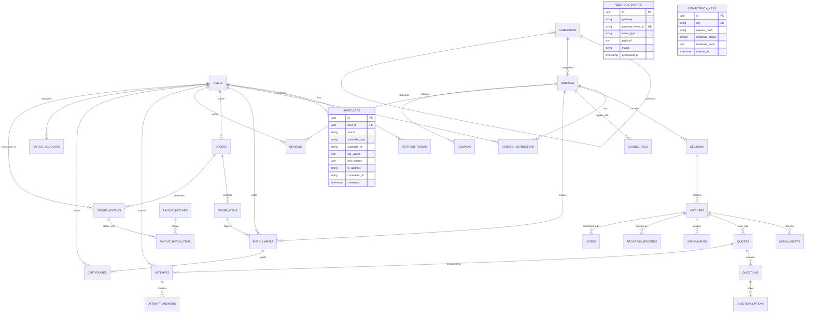

# Entity-Relationship Diagram (ERD) — LearnHub

```mermaid
erDiagram
    USERS ||--o{ REFRESH_TOKENS : has
    USERS ||--o{ AUDIT_LOGS : performs
    USERS ||--o{ COURSE_INSTRUCTORS : teaches
    USERS ||--o{ ENROLLMENTS : holds
    USERS ||--o{ ORDERS : places
    USERS ||--o{ REVIEWS : writes
    USERS ||--o{ ATTEMPTS : submits
    USERS ||--o{ CERTIFICATES : earns
    USERS ||--o{ PAYOUT_ACCOUNTS : configures
    USERS ||--o{ LEDGER_ENTRIES : referenced_in

    CATEGORIES ||--o{ CATEGORIES : parent_of
    CATEGORIES ||--o{ COURSES : categorizes

    COURSES ||--o{ COURSE_INSTRUCTORS : has
    COURSES ||--o{ SECTIONS : contains
    COURSES ||--o{ COURSE_TAGS : tagged_with
    COURSES ||--o{ ENROLLMENTS : creates
    COURSES ||--o{ REVIEWS : receives
    COURSES ||--o{ COUPONS : discounts

    SECTIONS ||--o{ LECTURES : contains

    LECTURES ||--o{ MEDIA_ASSETS : streams
    LECTURES ||--o{ QUIZZES : tests_with
    LECTURES ||--o{ ASSIGNMENTS : assigns
    LECTURES ||--o{ PROGRESS_RECORDS : tracked_by
    LECTURES ||--o{ NOTES : annotated_with

    ORDERS ||--o{ ORDER_ITEMS : contains
    ORDERS ||--o{ LEDGER_ENTRIES : generates

    ORDER_ITEMS ||--o{ ENROLLMENTS : triggers

    QUIZZES ||--o{ QUESTIONS : contains
    QUESTIONS ||--o{ QUESTION_OPTIONS : offers
    QUIZZES ||--o{ ATTEMPTS : evaluated_by
    ATTEMPTS ||--o{ ATTEMPT_ANSWERS : contains

    ENROLLMENTS ||--o{ CERTIFICATES : yields

    LEDGER_ENTRIES ||--o{ PAYOUT_BATCH_ITEMS : settles_into
    PAYOUT_BATCHES ||--o{ PAYOUT_BATCH_ITEMS : groups

    WEBHOOK_EVENTS {
        uuid id PK
        string gateway
        string gateway_event_id UK
        string event_type
        json payload
        string status
        timestamp processed_at
    }

    IDEMPOTENCY_KEYS {
        uuid id PK
        string key UK
        string request_hash
        integer response_status
        json response_body
        timestamp expires_at
    }

    AUDIT_LOGS {
        uuid id PK
        uuid user_id FK
        string action
        string auditable_type
        string auditable_id
        json old_values
        json new_values
        string ip_address
        string correlation_id
        timestamp created_at
    }
```
